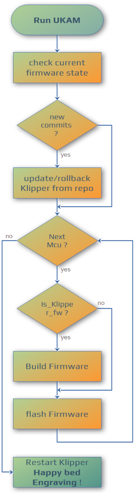

> [!CAUTION] 
> ## To RP2040 users
> The addition of RP2350, introduced by https://github.com/Klipper3d/klipper/pull/6725, causes corruption in the config file stored by UKAM. This occurs because the new RP2350 implementation modifies the way configuration data is handled, leading to incompatibilities with existing config file.
>
> To avoid issues, run UKAM with the menuconfig option next time. 
> ```
> ./ukam.sh -m
> ```
> This will allow you to review and adjust the MCU configuration settings, such as selecting the correct board type or communication interface.


# **UKAM[^1] v0.0.9** (Infinite Idle)

[^1]: Update Klipper And Mcus all-at-once. Works with Kalico too

UKAM is not so small bash script to update or rollback klipper/kalico and mcus (main, rpi, can, pico, ... ) and **keep trace of config file for the next update !**
> 

> [!WARNING]
> ### Good to know.
> Modern MCUs have limited write cycles (>100K cycles for an EEPROM, about 10K cycles for a STM32 chip). Updating the firmware with each release could shorten the life of your MCU.
> 
> ### How often should I use UKAM?
> UKAM checks the firmware version and skip flashing process if firmware is already
> up to date.
>
> There's often no point to keep firmware version aligned to host version. Major 
> changes in Klipper come from host code and documentation.
> 
> A good workflow should be : _"Check if there are changes in C files that could affect your printer"_
> or wait for Klipper to ask for firmware update at startup.
> 
> ### So why do I need UKAM ?
> It will make your life easier when Klipper asks you to update your MCUs.

> [!NOTE]
> The actual version is tagged 0.0.9.
>
> New features :
> - improve rollback feature
> 

## Table of Contents 
- [What UKAM does ?](#what-ukam-does-)
- [Installation](#installation)
  - [Method 1 : git clone (recommended)](#method-1--git-clone)
  - [Method 2 : manual copy](#method-2--manual-copy)
- [Update UKAM with Moonraker](#update-ukam-with-moonraker)
- [Usage](#usage)
  - [Options](#options)
  - [Rollback](#rollback)
- [Edit mcus.ini](#edit-mcusini)
  - [mcus.ini examples](#mcusini-examples-more-to-come-)
    - [RPi microcontroller](#rpi-microcontroller)
    - [Serial connection, UART](#serial-connection-uart)
    - [Mainboard , USB\_to\_CAN bridge mode (Katapult required)](#mainboard--usb_to_can-bridge-mode-katapult-required)
    - [RP2040 based board](#rp2040-based-board)
    - [Mainboard : USB connection](#mainboard--usb-connection)
    - [Toolhead : CANbus (Katapult required)](#toolhead--canbus-katapult-required)
    - [Toolchanger : USB connection](#toolchanger--usb-connection)
    - [Non Klipper firmwares](#non-klipper-firmwares)
- [About backup](#about-backup)
- [Questions & Answers](#qa)
- [TODO](#todo)
- [Aknowledgments](#aknowledgments)
  

## Disclaimer
> [!WARNING] 
> **This script does not replace your brain. If you don't know how to flash your boards, just go away !**
>
> I admit that this warning is a little condescending. You can find many guides explaining how to flash your boards, I can't list them all. See below some links i used as reference to build the script.
>
> - Klipper Documentation
>   - [Building and flashing the micro-controller](https://www.klipper3d.org/Installation.html#building-and-flashing-the-micro-controller),
>   - [Building and installing Linux host micro-controller code](https://www.klipper3d.org/Beaglebone.html#building-and-installing-linux-host-micro-controller-code),
>   - [SDCard update](https://www.klipper3d.org/SDCard_Updates.html),
>   - [Bootloader entry](https://www.klipper3d.org/Bootloader_Entry.html),
> - [maz0R Canbus guide](https://maz0r.github.io/klipper_canbus/),
> - Manufacturers documentations, 
> - ...
>
> The Esoterical [CANbus guide](https://canbus.esoterical.online/) and [USB guide](https://usb.esoterical.online/) are now the reference guides for firmware installation.
## What UKAM does ?
Update Klipper and apply firmware update for each mcu.



 Basically it runs:
 ```
git pull
service klipper stop
make clean
make menuconfig
make
<the_flash_command>
service klipper start
```


> [!IMPORTANT] 
> UKAM is also able to rollback Klipper version if thing goes wrong 

## Installation

### Method 1 : Git clone (recommended)
```
cd ~
git clone https://github.com/fbeauKmi/update_klipper_and_mcus.git ukam
```

Copy and edit `mcus.ini` from `examples` folder to `~/printer_data/config/ukam`


### Method 2 : Manual copy
Copy `ukam.sh` and  `/scripts/*.sh` in a folder of your pi, `~/ukam/` sounds as a good choice. Let's call this folder `~/<script_folder>` in this Readme.
Copy and edit `mcus.ini` from `examples` folder to `~/printer_data/config/ukam`

Ensure to make `ukam.sh` executable : 
```
chmod +x ~/<script_folder>/ukam.sh
chmod +x ~/<script_folder>/scripts/*.sh
```

> [!CAUTION]
> This method does not track update of the script 


## Update UKAM with Moonraker

Paste the lines below in moonraker.conf
```
[update_manager update_klipper_and_mcus]
type: git_repo
primary_branch: main
path: ~/ukam
origin: https://github.com/fbeauKmi/update_klipper_and_mcus.git
is_system_service: False
```
## Usage

Run `~/<script_folder>/ukam.sh` in a terminal, you can use the following options.

### Options 

#### -h --help : to see usage

```
Usage: ukam.sh [<config_file>] [-h]

UKAM, a Klipper Firmware Updater script. Update Klipper repo and mcu firmwares

Optional args: <config_file> Specify the config file to use. Default is 'mcus.ini'
  -c, --checkonly            Check if Klipper is up to date only.
  -b, --rebase               use rebase instead of fast forward to update Klipper
  -f, --firmware             Do not merge repo, force to update firmwares
  -m, --menuconfig           Show menuconfig for all Mcus (default do not show menuconfig)
  -r, --rollback             Rollback to a previous version
  -q, --quiet                Quiet mode, proceed all if needed tasks, !SKIP MENUCONFIG! 
  -v, --verbose              For debug purpose, display parsed config
  -h, --help                 Display this help message and exit
```
#### -c --checkonly
Check if Klipper is up-to-date, if not, it displays latest commits.
#### -f --firmware : to force MCUs update
Skip Klipper update to repo or force Mcus update if Klipper is already up to date 
#### -r --rollback
Rollback to the previous version saved by this script. It proceed a hard reset if the repo is dirty, untracked files will be erased, plugins will need to be reinstalled 

>[!TIP] 
> NEW : You can now go back to any commit if the saved value doesn't suit you.

#### -m --menuconfig
Do `make menuconfig` before firmware build, without this option the
Menuconfig is displayed only while config file for the mcu doesn't exists. 

#### -q --quiet : QUIET mode is Dangereous !

Quiet mode allows you to update all you configure without any interaction. Just run the script and all is done. But ....
- To use it, you need to run the script in interactive mode at least the first time.
- while features are modified/added/removed from menuconfig by klipper update, the config file is not updated. It may yield to a build issue.

### Rollback

You can also use UKAM to change Klipper or Kalico version, _if something goes wrong with the latest release_.
>[!TIP]
> There's no need to fully configure UKAM to use rollback.

Run `~/<script_folder>/rollback.sh` or `~/<script_folder>/rollback.sh --rollback` in a terminal
and follow the instructions.

There are three ways to revert Klipper to a previous version, depending on your needs:

- **By amount of commits:** Specify how many commits to go back from the current version. Use this if you know the number of updates since the desired version.  
  _e.g., if you are under v0.13.0-272, choose **92** to go back to v0.13.190._

- **By version tag:** Select a specific version tag to revert to. This is useful if you want to match an official release or a known stable version.  
  _e.g., if you are under v0.13.0-272, choose **190** to go back to v0.13.190._

- **By date (last commit before):** Roll back to the last commit before a given date. Use this if you want to restore the state as it was on a particular day, for troubleshooting or compatibility.  
  _e.g., if you are under v0.13.0-272, choose **2025-08-04** (use the format YYYY-MM-DD ) to go back to v0.13.190._

## Edit mcus.ini

`mcus.ini` contains : 
- sections : the name you give to your mcu between brackets \[\] (not necessarly the name in Klipper config)
- `klipper_section` : the name of section in Klipper without the bracket. It helps to track firmware version on mcus. _Tip : You can use same section name in mcus.ini as klipper instead._
> [!NOTE]
> Entry is case-sensitive. Ensure that the `klipper_section` matches the case of the corresponding name in the Klipper configuration.
- `config_name` [optional] : The name of the file used by menuconfig. Multiple MCU entries can share the same `config_name`. See [Toolchanger config example](#toolchanger--usb-connection).
- **NEW** `is_klipper_fw` [optional]: `true|false` Determines whether Klipper firmware should be built. By default, `true` for sections starting with `mcu`, `false` for other section types (e.g., `beacon`, `crampon`, `high_resolution_filament_sensor`, `scanner`, ...). See [Non Klipper firmwares examples](#non-klipper-firmwares)
- `action_command` [required] : command executed after the firmware build, whatever you need to prepare, flash or switch off/on the mcu. You can separate command by `;` or use several action_command in a section, they are executed in order of appearance.
- `quiet_command` : same as action_command but without stdout in QUIET mode

The flash command depends on you mcus and the way you choose to flash your board : dfu-util, make flash, flashtool, flash_sdcard, mount/cp/umount ... refer to your board documentation to choose the right command

> [!NOTE] 
> ### About bootloader entry
> Helpers makes easier to enter bootloader,(Thanks to @beavis) : `bootloader_serial.py`, `bootloader_usb.py` or newer `enter_bootloader` can be used
> ```
> Usage: enter_bootloader -t <usb|serial|can> -d <serial> [-b baudrate] | -u <canbus_uuid>
>    -t     type of actual firmware connection (serial|usb|can)
>    -d     serial id, only for serial and usb ( /dev/ttyAMA0, /dev/serial/by-id/...)
>    -b     baudrate for serial default is 250000
>    -u     canbus_uuid (if set -t become optional)   
> ```

### mcus.ini examples (more to come) : 
#### RPi microcontroller 
```elixir
# For Rpi
[RaspberryPi]
klipper_section: mcu rpi
action_command: make flash
```
_source : [Klipper doc](https://www.klipper3d.org/RPi_microcontroller.html#building-the-micro-controller-code)_

#### Serial connection, UART

```elixir
# For a MCU in usart, using flash_sdcard
# The second arg of flash_sdcard.sh is the cpu reference.
# A list of available values can be found here :
# https://github.com/Klipper3d/klipper/blob/master/scripts/spi_flash/board_defs.py

[mcu]
flash_command: ./scripts/flash-sdcard.sh /dev/ttyAMA0 btt-octopus-f446-v1
```
_source : [Klipper doc](https://www.klipper3d.org/SDCard_Updates.html)_

```elixir
# For mainboard using bootloader_serial helper 
[spider]
klipper_section: mcu
# spider on serial port (rpi gpio)
action_command: ~/klippy-env/bin/python3 ~/ukam/bootloader_serial.py /dev/ttyAMA0 250000
action_command: ~/klippy-env/bin/python3 ~/katapult/scripts/flashtool.py -d /dev/ttyAMA0 -b 250000
```
_source : [Klipper doc](https://www.klipper3d.org/Bootloader_Entry.html#physical-serial)_

#### Mainboard , USB_to_CAN bridge mode (Katapult required)

```elixir
# For a MCU in USB to Can bridge using Katapult as bootloader
# You have to insert your Canbus_uuid and Usb serial below
[octopus_usb2can]
klipper_section: mcu
quiet_command: ~/klippy-env/bin/python3 ~/katapult/scripts/flashtool.py -i can0 -r -u <YOUR_CANBUS_UUID>; sleep 2
action_command: ~/klippy-env/bin/python3 ~/katapult/scripts/flashtool.py -d /dev/serial/by-id/usb-katapult_stm32f446xx_<BOARD_ID>-if00

# using enter_bootoader function
[octopus_usb2can]
klipper_section: mcu
quiet_command: enter_bootloader -u <YOUR_CANBUS_UUID>
action_command: ~/klippy-env/bin/python3 ~/katapult/scripts/flashtool.py -d /dev/serial/by-id/usb-katapult_stm32f446xx_<BOARD_ID>-if00
```
_source : [Roguyt_prepare_command branch ^^](../roguyt_prepare_command/mcus.ini)_

#### RP2040 based board

```elixir
# For Pico RP2040
[pico]
klipper_section: mcu nevermore
#  No boot loader, need to manually enter in boot mode
action_command: sudo mount /dev/sda1 /mnt ; sudo cp out/klipper.uf2 /mnt ; sudo umount /mnt

[pico_bootloader]
klipper_section: mcu
# With katapult as bootloader
action_command: make flash FLASH_DEVICE=/dev/serial/by-id/usb-Klipper_rp2040_<BOARD_ID>-if00

[pico_bootloader]
klipper_section: mcu
# With katapult as bootloader
quiet_command: enter_bootloader -t usb -d /dev/serial/by-id/usb-Klipper_rp2040_<BOARD_ID>-if00
action_command: ~/klippy-env/bin/python3 ~/katapult/scripts/flashtool.py -d /dev/serial/by-id/usb-Katapult_rp2040_<BOARD_ID>-if00

```
_source: Cannot remember_ lol ;)

#### Mainboard : USB connection

```elixir
[catalyst]
klipper_section: mcu
# catalyst on usb-serial port (using bootloader_usb.py)
action_command: ~/klippy-env/bin/python3 ~/ukam/bootloader_usb.py /dev/serial/by-id/usb-Klipper_stm32f401xc_<board_serial>
quiet_command: sleep 1
action_command: ~/klippy-env/bin/python3 ~/katapult/scripts/flashtool.py -d /dev/serial/by-id/usb-katapult_stm32f401xc_<board_serial> -b 250000
```
_source : [Klipper doc](https://www.klipper3d.org/Bootloader_Entry.html#python-with-flash_usb)_

```elixir
[catalyst]
klipper_section: mcu
# catalyst on usb-serial port (using make flash)
action_command: make flash FLASH_DEVICE=/dev/serial/by-id/usb-Klipper_stm32f401xc_<board_serial>
```
_source : [Klipper doc](https://www.klipper3d.org/RPi_microcontroller.html#building-the-micro-controller-code)_

#### Toolhead : CANbus (Katapult required)

```elixir
[toolhead]
klipper_section: mcu ebb36
action_command: ~/klippy-env/bin/python3 ~/katapult/scripts/flashtool.py -u <canbus_uuid>
```

#### Toolchanger : Usb connection

```elixir
[mcu tool1]
quiet_command: enter_bootloader -t usb -d /dev/serial/by-id/usb-Klipper_rp2040_<BOARD1_ID>-if00
action_command: ~/klippy-env/bin/python3 ~/katapult/scripts/flashtool.py -d /dev/serial/by-id/usb-Katapult_rp2040_<BOARD1_ID>-if00

[mcu tool2]
# Share menuconfig with mcu tool1
config_name: mcu tool1
quiet_command: enter_bootloader -t usb -d /dev/serial/by-id/usb-Klipper_rp2040_<BOARD2_ID>-if00
action_command: ~/klippy-env/bin/python3 ~/katapult/scripts/flashtool.py -d /dev/serial/by-id/usb-Katapult_rp2040_<BOARD2_ID>-if00

[mcu toolN]
# Share menuconfig with mcu tool1
config_name: mcu_tool1
quiet_command: enter_bootloader -t usb -d /dev/serial/by-id/usb-Klipper_rp2040_<BOARDN_ID>-if00
action_command: ~/klippy-env/bin/python3 ~/katapult/scripts/flashtool.py -d /dev/serial/by-id/usb-Katapult_rp2040_<BOARDN_ID>-if00
```

_source : [issue #10](https://github.com/fbeauKmi/update_klipper_and_mcus/issues/10)_

#### Non Klipper firmwares
```elixir
#Cartographer
[cartographer]
klipper_section: mcu scanner
is_klipper_fw: false
action_command: ~/cartographer-klipper/scripts/firmware.py -d <canbus_uuid> -f CAN

# Crampon ADXL  
[crampon]
klipper_section: mcu crampon
is_klipper_fw: false
action_command: ~/crampon_anchor/update.sh
```
_source : [issue #12](https://github.com/fbeauKmi/update_klipper_and_mcus/issues/12)_

## About backup

A common way to backup your printer config and history is to save `~/printer_data` folder. To help to backup Ukam create a simlink at `~/printer_data/ukam`.
>[!TIP]
>[Klipper-backup](https://github.com/Armchair-Heavy-Industries/klipper-backup) from Armchair-Engineering is an easy tool to backup/restore your printer
>on a github account

## Questions & Answers
**Q : Can I rename a section ?** \
A : You can, but unless you rename the config file in `~/printer_date/ukam/config` you'll lose mcu config, and the menuconfig will appear the next times you Ukam.\
> [!TIP]
> In config name, a [space] becomes an underscore character

**Q : For some reason Mcu flash failed, what should I do ?** \
A : If `mcus.ini` is properly set. Check the board state (depends on the way 
you connect your board : `lsusb`, `flashtool.py` are common tools). If board is
visible, run the `./ukam.sh` again.

**Q: Does UKAM update Katapult ?** \
A : No, there's no point to update the bootloader.

**Q: Why does UKAM show that an error occurred, but the flash seemed to work?** \
A : In USB mode, `dfu-util` always returns an error code, even if flash is successful.
There's no way to get rid of this error. You can use another flashing method (_ie katapult_) 
to counterwork the error.  

## TODO
Not to much, the script works. If you have any suggestions feel free to contact me on Voron discord @fboc
## Aknowledgments

This script would be nothing without the development of [Klipper](https://github.com/Klipper3d/klipper),
[Moonraker](https://github.com/Arksine/moonraker) and [Katapult](https://github.com/Arksine/katapult). 
Many thanks to all contributors to these projects.

Thanks to OldGuyMeltPlastic and the Voron community who inspires the early version of this tool ([Video from OGMP](https://youtu.be/K-luKltYgpU) and 
[Voron documentation](https://docs.vorondesign.com/community/howto/drachenkatze/automating_klipper_mcu_updates.html))

Thanks to the Voron french community for supporting/tolerating me everyday ^^.
