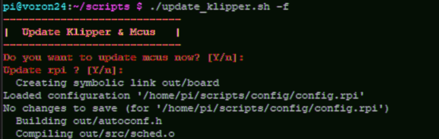

# update_klipper.sh : update Klipper and mcus all-at-once.



This is small bash script to update klipper and mcus (main, rpi, can, pico, ... ) and **keep trace of config file for the next update !**

# What it does ?
Update Klipper and apply firmware update for each mcu. Basically it runs:
```
git pull
service klipper stop
make clean
make menuconfig
make
<the_flash_command>
service klipper start
```

## Installation

### Copy ``update_klipper.sh`` and ``mcus.ini`` ...
...  and ``mcus.ini`` in a folder of your pi, ``~/scripts/`` sounds as a good choice. 

|
If you use a preversion of this script, copy the configuration files from ``~/klipper/`` to ``<script_folder>/config/``
|

### Edit mcus.ini

mcus.ini contains : 
- sections : the name you give to your mcu
- flash_commands : command to flash you mcu

The flash command depends on you mcus and the way you choose to flash your board : dfu-util, make flash, flashtool, flash_sdcard, mount/cp/umount ... refer to your board documentation to choose the right command

#### mcus.ini examples (more to come) : 
```
# For Rpi
[RaspberryPi]
flash_commands: make flash
```
_source : [Klipper docummentation](https://)

## Usage
```
Usage: update_klipper.sh [<config_file>] [-h]

Klipper Firmware Updater script. Update Klipper repo and mcu firmwares

Optional args: <config_file> Specify the config file to use. Default is 'mcus.ini'
  -f, --firmware             Do not merge repo, update firmware only
  -q, --quiet                Quiet mode, proceed all if needed tasks, !SKIP MENUCONFIG! 
  -h, --help                 Display this help message and exit
```

## TODO
not to much, the script works. If you have any suggestions feel free to contact me on Voron discord @fboc